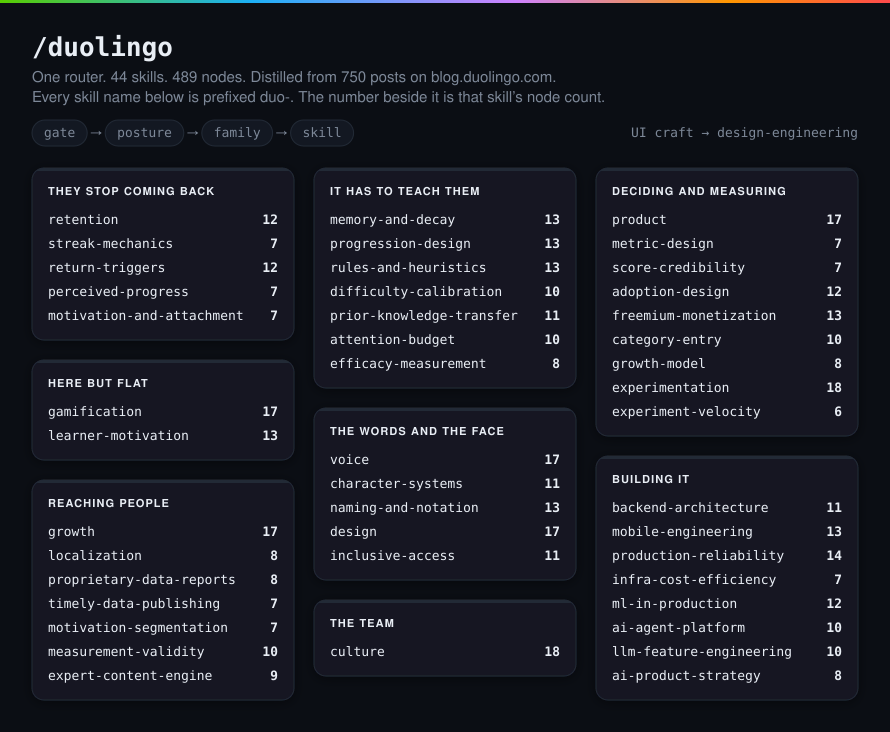
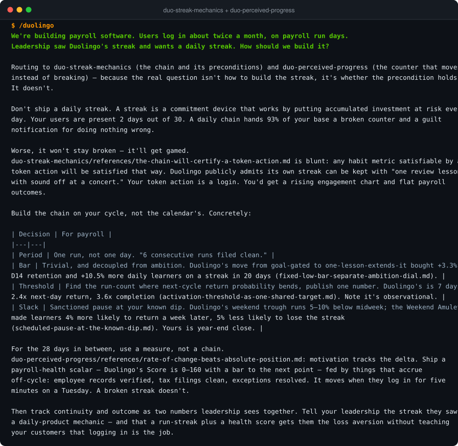
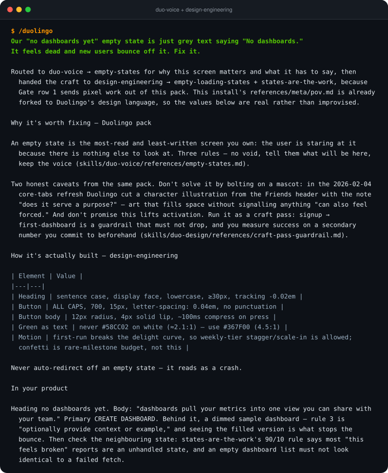
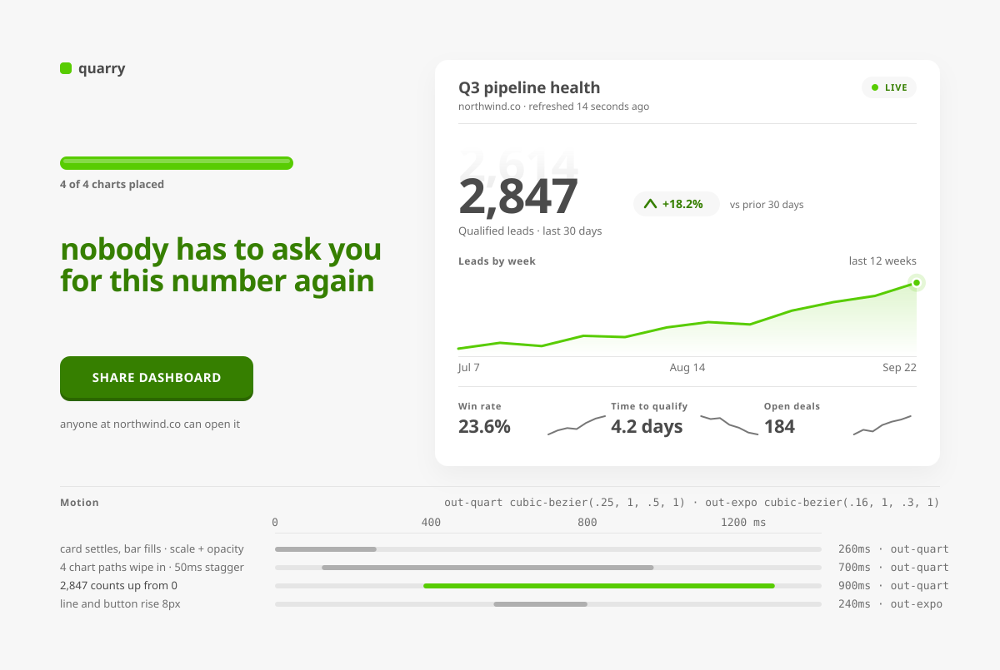
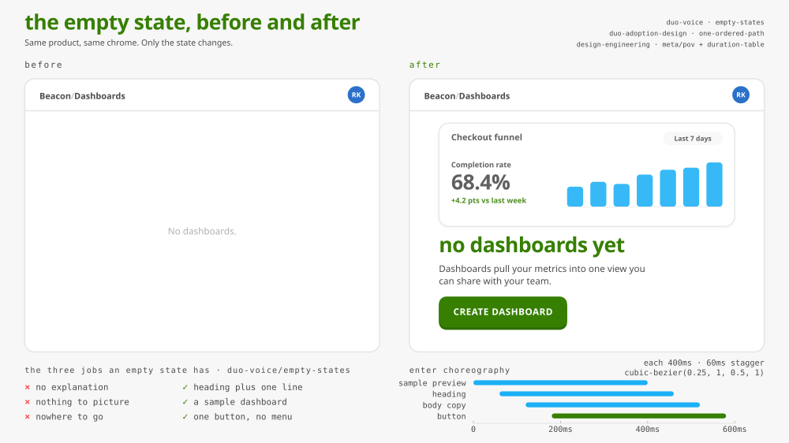
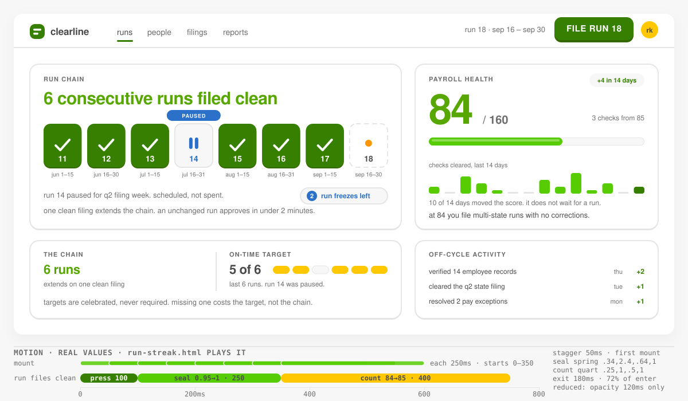
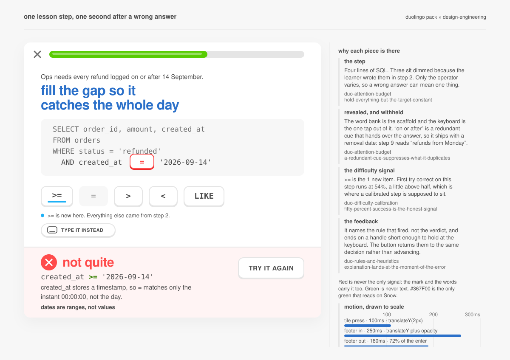
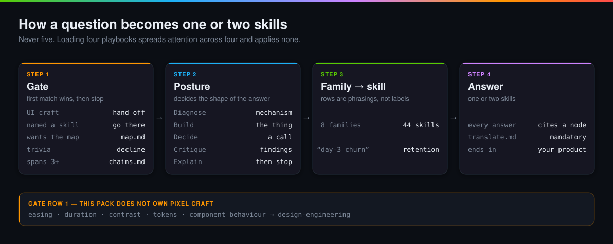

# Duolingo Skills

A **skill router** over 44 granular agent skills distilled from 750 English posts on the [Duolingo blog](https://blog.duolingo.com/archive/) and the [Duolingo Handbook](https://handbook.duolingo.com).

Type `/duolingo`, describe your problem, and it routes you to the one or two skills that own it.

Not "skills about Duolingo." Duolingo is the case study; **your product is the target**. Every node ends with *Apply to your product*.

```bash
npx skills add HKTITAN/duolingo
```



---

## Why this exists

Most "company playbook" content stops at the anecdote: *Duolingo has a streak, therefore add a streak.* That is trivia, and it does not survive contact with a product that is not a language app.

This pack extracts the **mechanism** under each move, the **numbers** that justify it, and the **precondition** it needs — then makes you check whether you actually share that precondition. Sometimes the honest answer is *no, and here is why*.

### Built to outlive its sources

`design.duolingo.com` used to be the Duolingo design system. It now 301-redirects to a four-post blog hub. Every skill that had cited it would have been pointing at nothing.

So every skill here is **self-contained**:

- The figure, the mechanism and the tradeoff live **in the node** — never behind a link.
- Citations are **stamped with the date they were true**: `blog.duolingo.com/friend-streak (Duolingo blog, 2024-08-05; accessed 2026-09-22)`.
- Every cited slug is checked against [`scripts/sources.json`](scripts/sources.json), the bibliography of all 842 crawled posts. **A fabricated or mistyped URL fails CI.**
- A node that tells you to go read the live site fails CI too.

The pack works with the network off, and it will still work if Duolingo reorganizes its blog again.

---

## See it work





<sub>Rendered from the real run output below &mdash; same text, set in a terminal.</sub>

These are **real runs**, not illustrations. Each one was produced by an agent that loaded
`/duolingo`, followed the gate → posture → family route, and read the actual nodes it landed on.
They double as the router's end-to-end test — and the run that produced them caught two router
files still pointing at a taxonomy that had been split apart, which is now a CI check.

| Scenario | Posture | Routed to |
|---|---|---|
| Diagnosing churn in a B2B tool | Diagnose | `duo-retention` + `duo-return-triggers` |
| Asking for a streak — and being told no | Decide | `duo-streak-mechanics` + `duo-perceived-progress` |
| Onboarding that has to actually teach | Build | `duo-rules-and-heuristics` + `duo-progression-design` |
| A north-star metric being gamed | Decide | `duo-metric-design` |
| A celebration moment | Build | `duo-gamification` + `design-engineering` |
| A dead empty state | Build | `duo-voice` + `design-engineering` |

<details>
<summary><b>Diagnosing churn in a B2B tool</b></summary>

> We make a B2B expense-reporting tool. People sign up, submit exactly one expense report, and we never see them again. Finance leads love the demo. What's going on?

*The router leads with the mechanism, not a feature. Note that it refuses to reach for a streak.*

---

**Routed to `duo-retention` (churn diagnostics) and `duo-return-triggers` (cues).** You're in a Diagnose posture, and the likely mechanism isn't that people dislike your product — it's that your product has no second occasion.

### First, check whether this is churn at all

When Duolingo's DAU stalled in 2018, the fix was to stop treating it as one number. Their Growth Model sorts every user into **7 mutually exclusive daily states** and tracks the transitions between them; simulating each lever showed one dominated, they staffed a team on it alone, and **DAU grew 4x from 2019** (`skills/duo-retention/references/churn-diagnostics.md`, citing blog.duolingo.com/growth-model-duolingo, 2023-02-17).

Your states aren't New/Current/Dormant. They're **"has an unsubmitted expense"** and **"doesn't."** A salesperson who expensed a client dinner in March and nothing since isn't churned — she had no occasion. So the first number is not day-N retention, it's **capture rate per occasion**: of the expense events that actually happened (card charges, receipt emails, booked trips), what share came through you?

- High capture → you don't have a retention problem, you have a dashboard problem.
- Low capture → the expense happened and went to a spreadsheet instead. That's the real churn, and it's a cue failure.

### If capture is low, fix the trigger, not the motivation

Of Duolingo's **23 published streak tips**, the structural ones are all trigger *relocation* — move the icon next to an app opened by reflex, add the widget, set it as the browser homepage. The **11:50pm alarm** is explicitly a backstop, not the plan (`skills/duo-return-triggers/references/piggyback-an-existing-high-frequency-trigger.md`). And bind recurrence to a person, place or time — never to intention, which has to be regenerated every occasion (`.../bind-the-cue-to-a-person-place-or-time.md`).

### Don't ship a streak

The precondition fails. Streaks assume a genuinely daily use case; imposing one on an episodic product manufactures guilt and churns people faster (`skills/duolingo/references/translate.md`). In your tool:

| Instead of | Ship |
|---|---|
| Push reminders to open the app | Submit-from-the-charge: the card notification *is* the cue, one tap, no app |
| A dashboard they must remember | Your entry point inside Slack/Outlook, where they already are |
| "Stay on top of expenses!" | A hard edge — "the 25th, or it lands next month" |

Last thing: finance leads love the demo because finance is your daily user and your buyer. They are not the cohort that leaves. Instrument the submitter.


<sub>**Nodes actually read:** `duolingo/SKILL.md`, `duolingo/references/map.md`, `duolingo/references/overlaps.md`, `duolingo/references/translate.md`, `duo-retention/SKILL.md`, `duo-retention/references/churn-diagnostics.md`, `duo-return-triggers/SKILL.md`, `duo-return-triggers/references/piggyback-an-existing-high-frequency-trigger.md`</sub>

</details>

<details>
<summary><b>Asking for a streak — and being told no</b></summary>

> We're building payroll software. Our users log in about twice a month, on payroll run days. Leadership saw Duolingo's streak and wants us to add a daily streak to drive engagement. How should we build it?

*The most useful thing a playbook can do is decline. The precondition is named, and an alternative is built on the product's real cycle.*

---

Routing to **duo-streak-mechanics** (the chain and its preconditions) and **duo-perceived-progress** (the counter that moves instead of breaking) — because the real question isn't how to build the streak, it's whether the precondition holds. It doesn't.

**Don't ship a daily streak.** A streak is a commitment device that works by putting accumulated investment at risk every day. Your users are present 2 days out of 30. A daily chain hands 93% of your base a broken counter and a guilt notification for doing nothing wrong.

Worse, it won't stay broken — it'll get gamed. `duo-streak-mechanics/references/the-chain-will-certify-a-token-action.md` is blunt: any habit metric satisfiable by a token action *will* be satisfied that way. Duolingo publicly admits its own streak can be kept with "one review lesson with sound off at a concert." Your token action is a login. You'd get a rising engagement chart and flat payroll outcomes.

**Build the chain on your cycle, not the calendar's.** Concretely:

| Decision | For payroll |
|---|---|
| Period | One run, not one day. "6 consecutive runs filed clean." |
| Bar | Trivial, and decoupled from ambition. Duolingo's move from goal-gated to one-lesson-extends-it bought **+3.3% D14 retention and +10.5% more daily learners on a streak in 20 days** (`fixed-low-bar-separate-ambition-dial.md`). |
| Threshold | Find the run-count where next-cycle return probability bends, publish one number. Duolingo's is 7 days — **2.4x next-day return, 3.6x completion** (`activation-threshold-as-one-shared-target.md`). Note it's observational. |
| Slack | Sanctioned pause at your known dip. Duolingo's weekend trough runs **5–10% below midweek**; the Weekend Amulet made learners **4% more likely to return a week later, 5% less likely to lose the streak** (`scheduled-pause-at-the-known-dip.md`). Yours is year-end close. |

**For the 28 days in between, use a measure, not a chain.** `duo-perceived-progress/references/rate-of-change-beats-absolute-position.md`: motivation tracks the delta. Ship a payroll-health scalar — Duolingo's Score is **0–160 with a bar to the next point** — fed by things that accrue off-cycle: employee records verified, tax filings clean, exceptions resolved. It moves when they log in for five minutes on a Tuesday. A broken streak doesn't.

Then track continuity and outcome as two numbers leadership sees together. Tell your leadership the streak they saw is a daily-product mechanic — and that a run-streak plus a health score gets them the loss aversion without teaching your customers that logging in is the job.


<sub>**Nodes actually read:** `duolingo/SKILL.md`, `duolingo/references/translate.md`, `duolingo/references/overlaps.md`, `duo-streak-mechanics/SKILL.md`, `duo-streak-mechanics/references/the-chain-will-certify-a-token-action.md`, `duo-streak-mechanics/references/activation-threshold-as-one-shared-target.md`, `duo-streak-mechanics/references/fixed-low-bar-separate-ambition-dial.md`, `duo-streak-mechanics/references/scheduled-pause-at-the-known-dip.md`</sub>

</details>

<details>
<summary><b>Onboarding that has to actually teach</b></summary>

> We need to onboard non-technical ops staff into writing SQL filters in our admin tool. Today we give them a 40-page PDF and they never open it. How should we structure this?

*The learning-science family — the part of Duolingo almost nobody copies.*

---

Routed to **duo-rules-and-heuristics** (whether to explain at all, and when the explanation lands) and **duo-progression-design** (what order, with how much support). The 40-page PDF is the tell: this is a docs-versus-practice problem, not a writing problem.

**Don't rewrite the PDF.** Knowing a rule and being able to run one are stored in different memory systems — a document only builds the first, and it's the second that fires when someone is staring at a filter box. "They didn't read the docs" is usually false: they read them, stored them in the wrong place, and couldn't retrieve them at the decision point (`skills/duo-rules-and-heuristics/references/two-memory-systems-explanation-loads-the-wrong-one.md`).

Four moves:

| Move | What it looks like |
|---|---|
| **Cut the 40 pages** | Keep only what an ops person would *never* discover from normal use — `NULL` not matching `!=`, timezone boundaries, `LIKE` wildcards. Silent wrong-result cases. Everything they'd work out themselves is costing attention the un-inferable things needed (`where-explicit-instruction-earns-its-place.md`). |
| **Table → procedure** | Duolingo replaces 11 Italian article forms with 4 ordered questions, and teaches Spanish negative commands as a 4-step algorithm with 2 complete worked traces — demoting the 14-verb table to reference underneath. Do the same: which table? which column? equality, range or membership? NULL-safe? And mark the minimum required subset — their `gustar` diagram has 5 columns, only 2 marked required (`turn-the-table-into-a-procedure.md`). |
| **Explanation at the error** | Smart Tips fire after a *specific* mistake and measurably reduced subsequent errors; they shipped to 20 units across the four biggest courses. Your validator should name the rule that fired, not say "invalid query" (`explanation-lands-at-the-moment-of-the-error.md`). |
| **One sitting, three stages** | Pick a filter from a list → copy a worked one → write one unaided. Ending on the operation you started on leaves them with recognition they can't retrieve (`recognition-then-guided-then-production.md`). |

Then schedule the fade before you ship it: builder UI beside the SQL box, then SQL only. Support that never decays makes people fluent in the scaffold (`scaffold-and-fade-on-a-schedule.md`).

**One honest caveat.** Task-first sequencing doesn't always win. Duolingo's own A/B has themed, integrated lessons going 40% → 54% on preterite accuracy while the stripped-down explicit drill went 36% → 86% (`sequence-by-task-not-by-taxonomy.md`). Task-first won motivation; the drill won precision. Filters that touch deletion, billing or outbound email are your high-consequence case — break those out as an isolated, drilled, reviewed set and say why you did.

Concretely: week one, each ops hire ships one real filter against a sandboxed copy of production, in crude form, on day one. The PDF becomes a one-page decision procedure plus two worked traces, and the rest of it moves into your admin tool's error text.


<sub>**Nodes actually read:** `duolingo/SKILL.md`, `duolingo/references/translate.md`, `duolingo/references/chains.md`, `duolingo/references/overlaps.md`, `duo-rules-and-heuristics/SKILL.md`, `duo-rules-and-heuristics/references/two-memory-systems-explanation-loads-the-wrong-one.md`, `duo-rules-and-heuristics/references/explanation-lands-at-the-moment-of-the-error.md`, `duo-rules-and-heuristics/references/where-explicit-instruction-earns-its-place.md`</sub>

</details>

<details>
<summary><b>A north-star metric being gamed</b></summary>

> Our north-star metric is weekly active users. We just found out two of our biggest customers run a script that opens the dashboard every morning so their seats look used at renewal time. What do we replace it with?

*Duolingo published the same failure and its fix, with numbers.*

---

Routing to **`duo-metric-design`** — this is the "our metric is getting gamed" row, and the posture is Decide, so you get a call and the trade, not a build.

**Don't replace WAU with a better count. Replace it with a threshold percentage.**

Your customers didn't break WAU. They found the cheapest way to raise it, which is the same thing your own roadmap would have done eventually. Duolingo rewrote its north star three times for exactly this reason — Total Sessions, then Time Spent Learning, then Time Spent Learning Well. Total Sessions failed in an instructive way: it *penalised* learners who advanced to harder content, because harder work produces fewer countable units. Three generations is a healthy sign, not a failure (`skills/duo-metric-design/references/pair-every-growth-metric-with-a-quality-proxy.md`).

The move that fixes your specific failure is the second rewrite. While the goal was aggregate Total Time Spent Learning, leaderboard improvements grew the number **almost entirely through already-hyperactive learners**. Duolingo switched to *the percentage of learners spending at least 15 minutes a day* — a bar derived from formal studies, internal curriculum experts, and analysis of real behaviour, not from where the median sat (`.../threshold-percentage-not-aggregate-total.md`).

For your dashboard, in order:

| Step | What it means for you |
|---|---|
| Define the eligible event first | A page load is not an event. Only actions that change a decision count — a filter saved, an export, an alert acted on. The morning script now produces zero. |
| Pick the bar from outcome data | Not "weekly active". *What weekly behaviour did accounts that actually renewed or expanded show?* Derive it, then publish the derivation — the next PM will want to move it when it's inconvenient. |
| Weight, don't memo | Duolingo's formula is `Minutes on Path + 0.5 × Minutes in Other Lessons`. If a shared report is worth 2× a solo view, that ratio goes in the formula, not the strategy doc (`.../put-the-weight-in-the-formula-not-the-memo.md`). |
| Keep raw WAU read-only | It still tells you about load and cost. It just stops deciding whether anyone did a good job. |

Accept the cost: a threshold metric is deliberately blind above the line, so your two biggest customers getting genuinely deeper will register as zero. That is the point. And name, in writing, the dumbest way your new number could double without a single seat being better off — if you can't, you don't understand it yet.


<sub>**Nodes actually read:** `duolingo/SKILL.md`, `duolingo/references/translate.md`, `duolingo/references/overlaps.md`, `duo-metric-design/SKILL.md`, `duo-metric-design/references/pair-every-growth-metric-with-a-quality-proxy.md`, `duo-metric-design/references/put-the-weight-in-the-formula-not-the-memo.md`, `duo-metric-design/references/threshold-percentage-not-aggregate-total.md`, `duo-measurement-validity/SKILL.md`</sub>

</details>

<details>
<summary><b>A celebration moment</b> &mdash; Duolingo + design-engineering</summary>

> When someone finishes building their first dashboard in our analytics product, we want a celebration moment. What should it be, and how should it actually move on screen?

*Gate row 1 fires. Duolingo decides whether and when; design-engineering decides how it moves.*

---

**Routed to two packs.** Gate row 1 fired — this is UI craft — so `duo-gamification` answers *what and when*, and the handoff sends the *how* to `design-engineering` (whose `meta/pov.md` is already forked to Duolingo's design language).

**What the moment should be (Duolingo pack).** Not confetti. `duo-gamification/references/celebration-moments.md` records that Duolingo replaced number-balloons with a phoenix transformation because balloons were "cute, but not quite celebratory enough" — the celebration changed *the thing the user cares about*, rather than decorating the screen. Your equivalent: the dashboard itself performs — charts draw in, the first real number counts up, then one card offers a share link. The same Duolingo project shipped a one-tap share card so the moment leaves the app without the user leaving.

**One caution.** That node's rule is three tiers, not one. If a first-dashboard takeover is your *only* celebration, it reads as random. You need a tick on every saved widget and a medium beat on each completed chart first.

**How it moves (design-engineering).**

| Layer | Value | Node |
|---|---|---|
| Total celebration | 600–1200ms | `duration-table` |
| Card stagger / hero motion | 400–800ms (first-run budget) | `duration-table` |
| Easing | `cubic-bezier(0.34, 1.56, 0.64, 1)` for the overshoot; `cubic-bezier(0.25, 1, 0.5, 1)` for entrances | `easing-curves` |
| Exit | 60–80% of enter | `duration-table` |
| Properties | `transform` and `opacity` only | `transform-opacity-only` |

`animation-decision-framework`: purpose must be feedback, not decoration; check it still feels right at 25% playback. `delight-impact-curve` licenses the big tier here precisely because building a first dashboard happens once per user.

**Non-negotiable:** `prefers-reduced-motion` (5–15% of users) — celebration drops first. Ship a static "your dashboard is live" state with a 120ms opacity fade, and never let color alone carry the success signal.


<sub>**Nodes actually read:** `duolingo/SKILL.md`, `duolingo/references/design-handoff.md`, `duolingo/references/translate.md`, `duo-gamification/SKILL.md`, `duo-gamification/references/celebration-moments.md`, `duo-gamification/references/juicy-feedback.md`</sub>

<sub>**From design-engineering:** `skills/design-engineering/references/meta/routing-table.md`, `skills/design-engineering/references/meta/pov.md`, `skills/design-engineering/references/motion/animation-decision-framework.md`, `skills/design-engineering/references/motion/duration-table.md`, `skills/design-engineering/references/motion/easing-curves.md`</sub>

</details>

<details>
<summary><b>A dead empty state</b> &mdash; Duolingo + design-engineering</summary>

> Our "no dashboards yet" empty state is just grey text saying "No dashboards." It feels dead and new users bounce off it. Fix it.

*Rationale from this pack, craft from design-engineering — neither pack answers it alone.*

---

Routed to **duo-voice → `empty-states`** for why this screen matters and what it has to say, then handed the craft to **design-engineering → `empty-loading-states` + `states-are-the-work`**, because Gate row 1 sends pixel work out of this pack. This install's `references/meta/pov.md` is already forked to Duolingo's design language, so the values below are real rather than improvised.

**Why it's worth fixing — Duolingo pack**

An empty state is the most-read and least-written screen you own: the user is staring at it because there is nothing else to look at. Three rules — no void, tell them what will be here, keep the voice (`skills/duo-voice/references/empty-states.md`).

Two honest caveats from the same pack. Don't solve it by bolting on a mascot: in the 2026-02-04 core-tabs refresh Duolingo *cut* a character illustration from the Friends header with the note "does it serve a purpose?" — art that fills space without signalling anything "can also feel forced." And don't promise this lifts activation. Run it as a craft pass: signup → first-dashboard is a guardrail that must not drop, and you measure success on a secondary number you commit to beforehand (`skills/duo-design/references/craft-pass-guardrail.md`).

**How it's actually built — design-engineering**

| Element | Value |
|---|---|
| Heading | sentence case, display face, lowercase, ≥30px, tracking `-0.02em` |
| Button | ALL CAPS, 700, 15px, `letter-spacing: 0.04em`, no punctuation |
| Button body | 12px radius, 4px solid lip, ~100ms compress on press |
| Green as text | never `#58CC02` on white (≈2.1:1) — use `#367F00` (4.5:1) |
| Motion | first-run breaks the delight curve, so weekly-tier stagger/scale-in is allowed; confetti is rare-milestone budget, not this |

Never auto-redirect off an empty state — it reads as a crash.

**In your product**

Heading `no dashboards yet`. Body: "dashboards pull your metrics into one view you can share with your team." Primary `CREATE DASHBOARD`. Behind it, a dimmed sample dashboard — rule 3 is "optionally provide context or example," and seeing the filled version is what stops the bounce. Then check the neighbouring state: `states-are-the-work`'s 90/10 rule says most "this feels broken" reports are an unhandled state, and an empty dashboard list must not look identical to a failed fetch.


<sub>**Nodes actually read:** `duolingo/SKILL.md`, `duolingo/references/design-handoff.md`, `duolingo/references/translate.md`, `duo-voice/SKILL.md`, `duo-voice/references/empty-states.md`, `duo-design/SKILL.md`, `duo-design/references/error-as-delight.md`, `duo-design/references/craft-pass-guardrail.md`</sub>

<sub>**From design-engineering:** `references/meta/routing-table.md`, `references/meta/pov.md`, `references/components/empty-loading-states.md`, `references/philosophy/states-are-the-work.md`, `references/philosophy/delight-impact-curve.md`</sub>

</details>


---

## Designs — Duolingo + design-engineering

The two packs split the work: the Duolingo skills decide **what the moment is and when it fires**, design-engineering decides **how it is actually built**. Every duration, easing curve, radius and contrast value below traces to a node — none were invented.

The clearest example is in the celebration: the share button is `#367F00`, not Duolingo's own Feather Green, because design-engineering's `pov.md` audits white-on-Feather-Green at ≈2.1:1 and notes *"Duolingo ships it; you should not."* Rationale from one pack, craft floor from the other.

<sub>SVG stills below. GitHub strips animation, so open [`docs/index.html`](docs/index.html) locally for the motion — which is the point of the design-engineering half.</sub>

### First dashboard complete

The instant a Quarry user finishes their first dashboard: the board itself performs — four chart paths wipe in on a 50ms stagger, the first real number counts 0 to 2,847 over 900ms, one earned line lands, one share button. Duolingo's rationale picks the celebration tier and writes the line; design-engineering supplies every curve, duration, radius and contrast value, with pov.md's audited #367F00 overriding Feather Green wherever the fill has to carry white text.



<details>
<summary>Traced decisions</summary>

| Choice | Value | From |
|---|---|---|
| No confetti. The celebration is the dashboard performing — charts drawing, the number counting — not an overlay on top of it. | three tiers, distinct grammar per tier; full-screen takeover is the rare-milestone grammar | `duo-gamification/celebration-moments + duo-design/celebration-design ("layer, don't stack") + philosophy/delight-impact-curve` |
| Share button fill is #367F00, not Feather Green #58CC02 | white on #58CC02 ≈ 2.1:1, on Tree Frog ≈ 3.0:1; #367F00 clears 4.5:1 on white | `meta/pov.md §8 (outranks §2's "when in doubt go green")` |
| Button lip #2B6600, reserved by a transparent 4px bottom border so the press causes no reflow | same hue, ~15% darker; press compresses 4px in 100ms | `meta/pov.md §1 and §5` |
| Display headline set in Tree Frog #58A700, lowercase, 36px/105%, tracking -0.02em, two balanced lines | lowercase always, 10 words max, leading 100–110%, tracking -0.02em, never below 30px, never in a neutral like Eel | `meta/pov.md §3 + typography/line-length-tracking (text-wrap: balance on headings)` |
| One line of copy: "nobody has to ask you for this number again" — names the outcome, not the action | reference what the user did; "Congratulations!" reads auto-generated; sentence case, no punctuation in headlines except ! | `duo-voice/celebration-copy + duo-voice/screenshot-bait + meta/pov.md §6` |
| Card settles scale 0.95 → 1 + opacity over 260ms | 0.95, never scale(0); modal class 200–300ms | `motion/never-scale-from-zero + motion/duration-table` |
| Four chart paths reveal with clip-path inset wipe, 700ms each, 50ms apart | stagger sweet spot 30–80ms, cap at 12 items; celebration band 600–1200ms; clip-path is the sanctioned reveal tool | `motion/stagger-choreography + motion/duration-table + motion/transform-opacity-only` |
| 2,847 counts up from 0 over 900ms, eased on the same out-quart curve as everything arriving with it | celebration 600–1200ms; cubic-bezier(.25, 1, .5, 1) | `motion/duration-table + motion/easing-curves + meta/pov.md §5 ("a number that counts up")` |
| Headline and button rise translateY(8px) → 0 in 240ms on out-expo | 8px is the node's own compose-with-translate figure; popover band 150–250ms; cubic-bezier(.16, 1, .3, 1) | `motion/transform-opacity-only + motion/duration-table + motion/easing-curves` |
| Progress bar fills scaleX(0.75) → scaleX(1), full radius with an inset white highlight | 75% is the real prior state (3 of 4 charts), so nothing scales from zero; the 95–100% transition is where the reward lands | `motion/never-scale-from-zero + meta/pov.md §4 + duo-design/progress-bars` |

<sub>Live version: [`docs/designs/celebration.html`](docs/designs/celebration.html)</sub>

</details>

### Empty state, before and after

A dead "No dashboards." panel next to its redesign, built from the Duolingo pack's empty-state rationale and design-engineering's pov.md craft values — every colour, radius, duration and easing curve traceable to the node it came from, annotated in the SVG source.



<details>
<summary>Traced decisions</summary>

| Choice | Value | From |
|---|---|---|
| CTA fill is #367F00, not Feather Green #58CC02 | #367F00 computes to 5.0:1 against Snow; white on #58CC02 is ~2.1:1 | `pov.md section 8 rule 1 (accessibility outranks every taste call) — ratios recomputed from the published hex, as pov.md itself does` |
| Button lip is #2E6C00 | 4px solid lip, same hue ~15% darker than its own fill | `pov.md section 1 — the fill was darkened for contrast, so the lip was re-derived by pov's own stated ratio rather than reusing Tree Frog` |
| Button geometry | 50px tall, 12px radius, 4px lip, label ALL CAPS 700 15px letter-spacing 0.04em, no punctuation | `pov.md section 1` |
| Heading is display-face, lowercase, 34px, tracking -0.02em, Tree Frog #58A700 | never below 30px, always lowercase, never set in a neutral; #58A700 is ~4.2:1 on Snow, which clears the large-text threshold at 34px/700 | `pov.md section 3 and section 2` |
| Sample chart is Macaw #1CB0F6, not green | Macaw owns information; green is left to mean only 'the action' | `pov.md section 2 — each secondary hue owns exactly one meaning` |
| Avatar is Humpback #2B70C9 | Humpback owns chrome; white on it computes to 4.9:1 | `pov.md section 2` |
| Radius scale 12px tiles / 16px cards, nothing pointy | 12px button, 16px panel and preview card, 9999px avatar and chip | `pov.md section 4 + references/surface/border-radius.md` |
| Preview card gets a whisper shadow, not a lip | 0 1px 1px and 0 2px 4px at 4% on a #111 base, via two chained feDropShadow | `references/surface/shadows-whisper.md — pov.md section 1 reserves the lip for pressable surfaces only` |
| Exactly one next action, no secondary button and no menu | one CREATE DASHBOARD button; the ordered path makes the next step unmissable on open | `duo-adoption-design/one-ordered-path-beats-a-branching-surface.md` |
| No mascot, no character illustration | the pixels go to the sample dashboard instead, because it signals something | `duo-voice/empty-states.md — the 2026 core-tabs refresh cut a character with the note 'does it serve a purpose?'; consistency-vs-purpose.md` |

<sub>Live version: [`docs/designs/empty-state.html`](docs/designs/empty-state.html)</sub>

</details>

### Run-streak and health score

A habit surface for a product used twice a month: a run-based chain that a scheduled pause carries across the known dip, beside a continuous health scalar that moves on ordinary days — built with the Duolingo pack's mechanics and design-engineering's craft values, every number traceable to the node it came from.



<details>
<summary>Traced decisions</summary>

| Choice | Value | From |
|---|---|---|
| The chain counts runs, not days, and the health scalar carries the 28 days between runs | one run = one link; 8 links shown (runs 11 to 18) | `skills/duolingo/SKILL.md — 'a product genuinely used twice a month does not have a retention problem, and a daily loop will only manufacture guilt'` |
| The on-time target sits beside the chain and never gates it; the card shows both numbers side by side across a 2px rule | chain 6 runs / target 5 of 6. Duolingo's decoupling returned +3.3% D14, +1% DAU, +10.5% more learners on a streak within 20 days | `duo-streak-mechanics/references/fixed-low-bar-separate-ambition-dial.md` |
| The floor line states the minimum viable day in time, not intent | 'an unchanged run approves in under 2 minutes' — the node's own under-2-minutes target | `duo-streak-mechanics/references/trivial-floor-protects-the-chain-not-the-outcome.md` |
| Run 14 is a sanctioned pause aimed at a known dip, and the chain still reads 6 consecutive because the pause carried it. The missed segment in the on-time meter sits at the same index, so the pause visibly cost the target and not the chain | paused for q2 filing week. Duolingo's Weekend Amulet was aimed at a measured 5–10% weekend trough: +4% week-later return, 5% less likely to lose the streak | `duo-streak-mechanics/references/scheduled-pause-at-the-known-dip.md` |
| Pause and freeze are drawn as two different instruments: the pause is an inset, unpressable tile with no lip, the freeze is a counted token with its balance shown before it is needed | '2 run freezes left' chip | `duo-streak-mechanics/references/scarce-recovery-token.md` |
| A fine-grained scalar beside the coarse chain, with the delta and the next increment, plus a 14-day trace proving it moves on ordinary days | 0–160 scale, bar to the next point, '+4 in 14 days', '3 checks from 85', '10 of 14 days moved the score' | `duo-perceived-progress/references/rate-of-change-beats-absolute-position.md` |
| The score is written as a can-do statement in the user's task language, not in internal units | 'at 84 you file multi-state runs with no corrections' | `duo-perceived-progress/references/a-portable-number-in-can-do-terms.md` |
| Every pressable surface gets a solid opaque lip in a darker shade of its own fill, reserved by a transparent bottom border so pressing causes no reflow. Whisper shadows are left to the one floating layer | 4px lip on the button, 2px on cards and tiles; window shadow layered at 5/5/4% on a #111 base | `references/meta/pov.md §1 + references/surface/shadows-whisper.md` |
| Every text-bearing green surface uses the darkened green pov sanctions, because pov §8 refuses to ship white on Feather Green. Feather Green survives only as a non-text fill | #367F00 fills with lip #366800 (derived by pov's own Feather-to-Tree-Frog ratio: red held, green channel x0.82). #58CC02 only on the progress bar and sparkline | `references/meta/pov.md §8 + references/components/accessibility-baseline.md` |
| Right and wrong are never carried by colour alone: filed, paused and open are three different glyphs and three different constructions | check / two pause bars / hollow Fox dot in a dashed ring | `references/components/accessibility-baseline.md` |

<sub>Live version: [`docs/designs/run-streak.html`](docs/designs/run-streak.html)</sub>

</details>

### A lesson step that teaches

One step of an in-product lesson teaching ops staff to write a SQL filter, drawn at the peak frame 250ms after a wrong answer: the scaffold, its scheduled removal, the difficulty flag, and feedback that names the rule instead of the verdict.



<details>
<summary>Traced decisions</summary>

| Choice | Value | From |
|---|---|---|
| Three of the four SQL lines are dimmed to Hare #AFAFAF; only the operator slot is live | one varying dimension per teaching unit | `duo-attention-budget/hold-everything-but-the-target-constant` |
| No syntax highlighting in the code block — the slot is the only coloured thing in it | decoration spends from the same budget as the target | `duo-attention-budget/salience-is-a-budget-and-it-front-loads` |
| The prompt is the only display-face element on the canvas; every annotation is 12.5px body face | attention amplifies one signal and suppresses the rest | `duo-attention-budget/salience-is-a-budget-and-it-front-loads` |
| "on or after" in the brief is labelled a redundant cue and carries a written removal date (step 9 reads "refunds from Monday") | the cue is only scaffolding if its removal is scheduled in the same change that adds it | `duo-attention-budget/a-redundant-cue-suppresses-what-it-duplicates` |
| The new operator carries a visible Macaw flag plus the line ">= is new here. Everything else came from step 2." | 5–7 new items per lesson, 90/10 known-to-new, and the new element is visually flagged | `duo-difficulty-calibration/the-narrow-band-between-bored-and-lost` |
| Rail reports 54% first-try correct against a target band just above half | a little more than half the time is the honest signal; MAE 0.13 puts p=0.5 in a 37–63% band | `duo-difficulty-calibration/fifty-percent-success-is-the-honest-signal` |
| Word bank shown (recognition stage), with TYPE IT INSTEAD on the exercise itself | tap the option early, type it unaided later; the keyboard icon sits on the exercise, one tap away, not in settings | `duo-progression-design/recognition-then-guided-then-production + make-the-scaffold-removable-by-the-user` |
| The footer states the rule ("created_at stores a timestamp, so = matches only the instant 00:00:00") rather than "Incorrect" | name the governing rule, not the verdict — "wrong" carries one bit | `duo-rules-and-heuristics/explanation-lands-at-the-moment-of-the-error` |
| The footer closes on the handle "dates are ranges, not values" | compress the rule to something holdable in one breath at the decision point | `duo-rules-and-heuristics/give-them-a-handle-they-can-hold-under-pressure` |
| Button reads TRY IT AGAIN, not CONTINUE | let it practise, not just tell — another instance of the same decision while attention is still on the gap | `duo-rules-and-heuristics/explanation-lands-at-the-moment-of-the-error` |

<sub>Live version: [`docs/designs/teach-step.html`](docs/designs/teach-step.html)</sub>

</details>

---

## Install

```bash
# everything (router + all skills)
npx skills add HKTITAN/duolingo

# just the router and one skill
npx skills add HKTITAN/duolingo --skill duolingo --skill duo-streak-mechanics
```

Works with [skills.sh](https://skills.sh) across Claude Code, Cursor, Codex, Windsurf, Aider, Cline, Gemini CLI and the rest of its matrix. Also ships an [agent-plugins.org](https://agent-plugins.org) manifest ([`plugin.json`](plugin.json)) and a Claude Code plugin ([`.claude-plugin/`](.claude-plugin/)), so `/duolingo` works as a slash command.

**Pairs with [design-engineering](https://github.com/AgentsORG/design-engineering).** This pack owns *why* an interface should behave a certain way; it deliberately does not own easing curves, contrast ratios or token values. Design questions route out — see [`design-handoff.md`](skills/duolingo/references/design-handoff.md). Install both for the full path from product rationale to shipped motion:

```bash
npx skills add AgentsORG/design-engineering
```

---

## The 44 skills

Start at **`/duolingo`** — it routes. The families below are how it groups them.

### They stop coming back

| Skill | Nodes | Owns |
|---|---|---|
| [`duo-retention`](skills/duo-retention/SKILL.md) | 12 | Why people stop coming back, how to find the day they leave, and what that drop-off shape tells you to fix. |
| [`duo-streak-mechanics`](skills/duo-streak-mechanics/SKILL.md) | 7 | How to design an unbroken-chain commitment counter — how low to set the daily bar, how much slack to build in, when to let it pause, and what it will quietly certify that you did not intend. |
| [`duo-return-triggers`](skills/duo-return-triggers/SKILL.md) | 12 | How to cause the next session to start — the cue, the surface, the permission ask, and the re-entry path for someone who already stopped. |
| [`duo-perceived-progress`](skills/duo-perceived-progress/SKILL.md) | 7 | How to make effort feel like it is going somewhere — the granularity of your progress number, the size of your completion unit, the honesty of your timeline, and what to do when the user stalls because they succeeded. |
| [`duo-motivation-and-attachment`](skills/duo-motivation-and-attachment/SKILL.md) | 7 | How to find out which users will still be here in a year and why — segmenting by motive rather than demographics — and how to build the attachment, safety and permission that keep an optional behaviour worth doing. |

### They are here but flat

| Skill | Nodes | Owns |
|---|---|---|
| [`duo-gamification`](skills/duo-gamification/SKILL.md) | 17 | The reward layer — points, levels, celebration, and the line where a loop stops being fun and starts feeling owed. |
| [`duo-learner-motivation`](skills/duo-learner-motivation/SKILL.md) | 13 | Get people to keep attempting the thing — by lowering what it costs to be visibly bad at it, replacing unreachable goals with ones they can score, and telling them in advance how bad it will feel. |

### The product has to teach them something

| Skill | Nodes | Owns |
|---|---|---|
| [`duo-memory-and-decay`](skills/duo-memory-and-decay/SKILL.md) | 13 | Decide when to bring something back in front of a user, and treat every capability they have as something that is quietly rotting rather than something they banked. |
| [`duo-progression-design`](skills/duo-progression-design/SKILL.md) | 13 | Decide what to teach, in what order, with how much support — and design the removal of that support rather than leaving it in forever. |
| [`duo-rules-and-heuristics`](skills/duo-rules-and-heuristics/SKILL.md) | 13 | Decide whether to explain at all, when the explanation lands, and how to compress a rule into something a user can actually execute under pressure. |
| [`duo-difficulty-calibration`](skills/duo-difficulty-calibration/SKILL.md) | 10 | Put each user at the edge of what they can currently do — model ability and item difficulty together, target a band rather than a floor, and use live signals to tell whether the model is honest. |
| [`duo-prior-knowledge-transfer`](skills/duo-prior-knowledge-transfer/SKILL.md) | 11 | Work with the model your users already carry from somewhere else — it is why some things are free, why the near-misses are your most expensive errors, and why confusion clusters exactly where two things are almost the same. |
| [`duo-attention-budget`](skills/duo-attention-budget/SKILL.md) | 10 | Treat working memory as the binding constraint on any screen, session or document — cap what competes for it, strip what wastes it, and deliberately spend what is left on the one thing you are trying to teach. |
| [`duo-efficacy-measurement`](skills/duo-efficacy-measurement/SKILL.md) | 8 | Prove the thing actually works — with instruments you did not author, on axes that do not substitute for each other, and in a way a sceptic outside your company can check. |

### The words and the face

| Skill | Nodes | Owns |
|---|---|---|
| [`duo-voice`](skills/duo-voice/SKILL.md) | 17 | A product voice that survives more than one writer — push copy, error messages, empty states, and what tone costs the reader. |
| [`duo-character-systems`](skills/duo-character-systems/SKILL.md) | 11 | How to build a reusable cast, illustration style, animation vocabulary and voice set that a small team can produce at volume, and how to make those assets do real product work instead of decorating it. |
| [`duo-naming-and-notation`](skills/duo-naming-and-notation/SKILL.md) | 13 | How to name things, design symbols and write reference material so people can derive the answer instead of memorizing it — and how to handle the near-misses, overloaded tokens and silent misreadings that generate confident wrong behaviour. |
| [`duo-design`](skills/duo-design/SKILL.md) | 17 | How an interface decision gets made and what the result claims about the person using it. |
| [`duo-inclusive-access`](skills/duo-inclusive-access/SKILL.md) | 11 | How to stop your product from filtering on circumstance — removing preconditions, building escape hatches at the level of the blocked capability, and making sure you are not scoring people on things you never meant to measure. |

### Deciding and measuring

| Skill | Nodes | Owns |
|---|---|---|
| [`duo-product`](skills/duo-product/SKILL.md) | 17 | The rules a product org writes down and then has to hold when schedule and metric pressure arrive. |
| [`duo-metric-design`](skills/duo-metric-design/SKILL.md) | 7 | How to choose, weight and defend the single number a team is graded on, so that moving it means users actually got value rather than just spent time. |
| [`duo-score-credibility`](skills/duo-score-credibility/SKILL.md) | 7 | How to design a score, rating or level that you show to users and outsiders so it resists gaming, means something beyond your product, and survives scrutiny from people with an incentive to attack it. |
| [`duo-adoption-design`](skills/duo-adoption-design/SKILL.md) | 12 | How to get a shipped feature actually used — lowering the cost of starting, giving one obvious next step, and designing for the moment the user stalls, is embarrassed, is in the wrong place, or gets it wrong. |
| [`duo-freemium-monetization`](skills/duo-freemium-monetization/SKILL.md) | 13 | Where to draw the paid line when the free tier is your distribution engine — what to charge for, what to never charge for, and when the upsell costs more than it earns. |
| [`duo-category-entry`](skills/duo-category-entry/SKILL.md) | 10 | How to pick and enter a new market or add a second product line — where to attack an incumbent, what to port from the thing that already works, and what to rebuild from a blank page. |
| [`duo-growth-model`](skills/duo-growth-model/SKILL.md) | 8 | Decide what to measure and which single lever to staff when your top-line engagement number has gone flat — and how to read demand that arrives from outside your product. |
| [`duo-experimentation`](skills/duo-experimentation/SKILL.md) | 18 | Establishing that your change caused the effect — hypothesis, metric, guardrails, and when to kill it. |
| [`duo-experiment-velocity`](skills/duo-experiment-velocity/SKILL.md) | 6 | How to drive the marginal cost of an experiment toward zero — shared platform, self-serve tooling, standard readouts — so a team runs hundreds of tests a quarter instead of three. |

### Reaching people

| Skill | Nodes | Owns |
|---|---|---|
| [`duo-growth`](skills/duo-growth/SKILL.md) | 17 | Distribution other people perform for you — the friend graph, the shareable artifact, earned attention. |
| [`duo-localization`](skills/duo-localization/SKILL.md) | 8 | Ship your product to people who do not share your language, script, reading direction, demographics, narrative conventions or fluency with software — and decide which markets that opens. |
| [`duo-proprietary-data-reports`](skills/duo-proprietary-data-reports/SKILL.md) | 8 | Turn the behavioural logs you already hold into a recurring public report with a fixed window and published exclusions, so journalists, researchers and buyers cite it instead of discounting it. |
| [`duo-timely-data-publishing`](skills/duo-timely-data-publishing/SKILL.md) | 7 | Ship one finding fast — a spike, a commissioned survey, a score — so it gets picked up, and build in the baselines, hedges and caveats that stop a sceptical reader from dismissing it. |
| [`duo-motivation-segmentation`](skills/duo-motivation-segmentation/SKILL.md) | 7 | Ask users to declare why they are here, treat that answer as a first-class dimension alongside behaviour, and learn where self-report and telemetry each lie to you. |
| [`duo-measurement-validity`](skills/duo-measurement-validity/SKILL.md) | 10 | Design and report a number that survives an outsider's scrutiny: prove the outcome on an instrument you did not build, ship a breakdown only when it adds information, audit the instrument for bias, and disclose where your own hand touched the evidence. |
| [`duo-expert-content-engine`](skills/duo-expert-content-engine/SKILL.md) | 9 | Run your in-house expertise as a standing, credentialed publishing program fed by the questions users already send you — and earn the reader's trust by marking, in public, where your evidence stops. |

### Building it

| Skill | Nodes | Owns |
|---|---|---|
| [`duo-backend-architecture`](skills/duo-backend-architecture/SKILL.md) | 11 | How to make a server request fast and hard to break — what to delete from the request path, what to precompute versus inject, how long to hold a lock, and how to move a live system to a new runtime without stopping it. |
| [`duo-mobile-engineering`](skills/duo-mobile-engineering/SKILL.md) | 13 | How to make a shipped client app start fast, stay small and remain cheap to change — startup budgets tied to conversion, perceived latency, payload discipline, and the mechanics of migrating a large codebase without freezing the product. |
| [`duo-production-reliability`](skills/duo-production-reliability/SKILL.md) | 14 | How to know what production is actually doing and what to run when it breaks — always-on request identity, runtime dead-code detection, dogfooding and bug intake, incident command, kill switches that fail open, and repairing state users earned. |
| [`duo-infra-cost-efficiency`](skills/duo-infra-cost-efficiency/SKILL.md) | 7 | How to see, attribute and cut infrastructure spend without slowing the company down — hourly cost tagging, waste versus spend, sampling, provisioning headroom, and storage that expires by default. |
| [`duo-ml-in-production`](skills/duo-ml-in-production/SKILL.md) | 12 | How to decide where a learned model beats hand-written rules, what to evaluate it on, and how to run a generation pipeline that does not quietly produce errors at scale. |
| [`duo-ai-agent-platform`](skills/duo-ai-agent-platform/SKILL.md) | 10 | How to run LLM agents as production infrastructure rather than demos — separating what an agent is from how it runs, durable retryable steps, grading artifacts instead of prose, give-up rules for automated producers, and getting the capability adopted internally. |
| [`duo-llm-feature-engineering`](skills/duo-llm-feature-engineering/SKILL.md) | 10 | How to build an LLM or agent feature that still works on the ten-thousandth call: prompt structure, task decomposition, grounding, memory, verification, evals, and the guardrails that keep a model's mistakes cheap. |
| [`duo-ai-product-strategy`](skills/duo-ai-product-strategy/SKILL.md) | 8 | Where to point AI so it changes your cost structure instead of adding a feature — which bottleneck to attack, how to divide labor between your experts and your models, when to adopt, and how to make an AI-driven product trustworthy enough to buy. |

### The team

| Skill | Nodes | Owns |
|---|---|---|
| [`duo-culture`](skills/duo-culture/SKILL.md) | 18 | How the team runs — operating principles, talent density, candor, hiring signal, ramping new people. |

---

## How the router works

[`skills/duolingo/SKILL.md`](skills/duolingo/SKILL.md) is a two-level dispatcher, not a list.



1. **Gate** — five first-match-wins checks that short-circuit routing. Is it UI craft? Hand off. Did the user already name a skill? Go there. Is it Duolingo trivia rather than a pattern? Say no skill applies.
2. **Posture** — Diagnose / Build / Decide / Critique / Explain. This decides the *shape* of the answer. Handing an implementation to someone who is still deciding is the most common routing failure.
3. **Family, then skill** — eight families, then the row whose phrasing matches. A flat 44-row table is unusable; two levels is navigable.
4. **Always** — [`translate.md`](skills/duolingo/references/translate.md) forces the answer to end in *your* product, and the node path gets cited so you can go disagree with it.

Supporting files:

| File | What it does |
|---|---|
| [`map.md`](skills/duolingo/references/map.md) | Full index, one line per skill, when the tables do not match |
| [`overlaps.md`](skills/duolingo/references/overlaps.md) | Confusable pairs and the single question that settles each |
| [`chains.md`](skills/duolingo/references/chains.md) | Ordered skill sequences for jobs spanning three or more skills |
| [`design-handoff.md`](skills/duolingo/references/design-handoff.md) | How UI questions leave the pack, and what to do when design-engineering is not installed |
| [`translate.md`](skills/duolingo/references/translate.md) | The rule that stops answers ending at Duolingo |
| [`sources.md`](skills/duolingo/references/sources.md) | What was read, what was skipped, and where Duolingo changed course |

---

## Structure

Each skill is a **graph**, not a file:

- **`SKILL.md`** — a Map of Content: one line per node plus `[[wikilinks]]`.
- **`references/*.md`** — atomic nodes, one complete thought each, following a fixed contract: **Concept → What Duolingo does → The transferable pattern → Apply to your product**.
- Nodes carry `metadata.internal: true` so the skills.sh CLI surfaces skills, not nodes.
- Cross-skill wikilinks make the whole pack one navigable graph.

Currently **45 skills** (44 + the router) and **495 nodes**.

---

## Honesty about the sources

The first version of this pack was written from memory and **it was substantially wrong**. Re-grounding every node against the real corpus caught, among others:

| Claimed | Actually |
|---|---|
| A "combo multiplier" mechanic | Appears nowhere in 842 posts. Invented. |
| "Aim for ~80% success rate; below 50% punishing" | Not a Duolingo figure. The published ones are 5–7 new words per lesson and a 90/10 known/new split. |
| League "cohorts of ~30 users" | Never stated. Removed. |
| Hearts as the live failure currency | Replaced by Energy in July 2025 — beginners were 2× more likely to run out mid-lesson. |
| Brand voice is "wholesome but unhinged" | The word "wholesome" appears nowhere in the corpus. The blog says "our slightly unhinged sense of humor". |

That is why the citation checks are CI-enforced rather than left to care. See [`sources.md`](skills/duolingo/references/sources.md) for the full provenance, including the 92 posts deliberately skipped and the 1,837 localized posts that were not read.

---

## Contributing

Read [`AGENTS.md`](AGENTS.md) — it is the authoring contract, and CI enforces most of it.

```bash
pip install pyyaml
python scripts/validate.py          # frontmatter, wikilinks, body contract, router coverage
python scripts/stamp_citations.py   # citations dated and resolving to real posts
```

The validator fails the build if a skill is unreachable from `/duolingo`, if the router names a skill that does not exist, if a node cites a slug outside the bibliography, or if a node defers to the live site.

## Sources

- The Duolingo Handbook — <https://handbook.duolingo.com>
- The Duolingo blog — <https://blog.duolingo.com/archive/> (750 of 842 English posts read; crawled 2026-09-22)
- Design craft companion — <https://github.com/AgentsORG/design-engineering>
- Skill-graph idea — [@akshay_pachaar](https://x.com/akshay_pachaar/status/2024848778415755327)
- Distillation method — the "borrow a brain" approach from [aiforui.dev](https://aiforui.dev) by Emil Kowalski

## License

MIT
